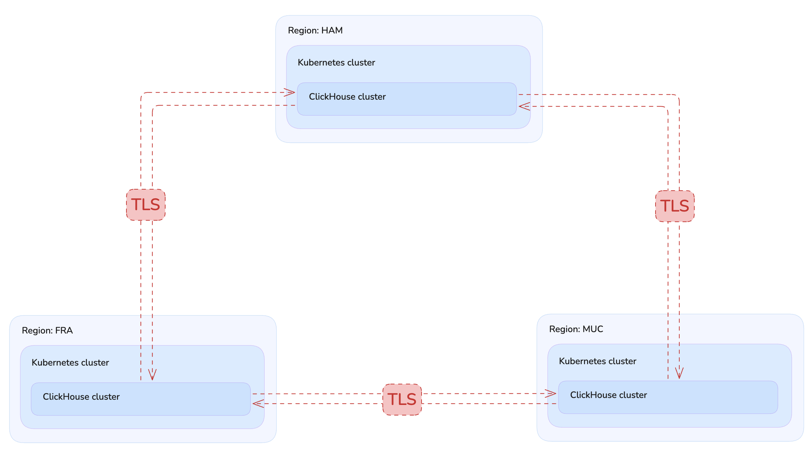
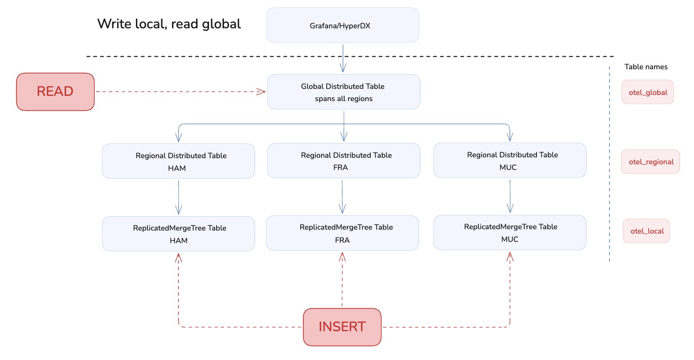

# ClickHouse Multi-Region Federation

- Three independent ClickHouse clusters - one per region (FRA, MUC, HAM) on Kubernetes deployed
with CLickHouse Operator.
- Cross-region access is via query-level federation only; no replication or Raft ever
crosses a region boundary.
- All intra-cluster traffic is fully encrypted.

---

## Table of contents

1. [Architecture](#architecture)
2. [Schema tiers](#schema-tiers)
3. [Repository layout](#repository-layout)
4. [Prerequisites](#prerequisites)
5. [Quick start](#quick-start)
6. [What setup.sh does](#what-setupsh-does)
7. [Running queries](#running-queries)
8. [Teardown](#teardown)
9. [Design notes](#design-notes)
    - [Three separate kind clusters](#three-separate-kind-clusters)
    - [Single-node Keeper](#single-node-keeper-with-localhost-raft-hostname)
    - [Single replica per region](#single-replica-per-region)
    - [Dynamic federation patching](#dynamic-federation-patching)
    - [Shard pruning and optimize_skip_unused_shards](#shard-pruning-and-optimize_skip_unused_shards)
    - [TLS for cross-region communication](#tls-for-cross-region-communication)
    - [Stale Keeper digest after pod restart](#stale-keeper-digest-after-pod-restart)

---

## Architecture



All three kind clusters share the Docker/Podman `kind` network. Cross-region
queries route from a CH pod through its node (via kube-proxy masquerade) to
the target region's NodePort. The `global` remote_servers config is patched
with real node IPs after clusters are up.

**Host port mapping:**

| Region | HTTP            | Native TCP      | Native TCP (TLS) |
|--------|-----------------|-----------------|------------------|
| FRA | localhost:8801  | localhost:9801  | localhost:9841   |
| MUC | localhost:8802  | localhost:9802  | localhost:9842   |
| HAM | localhost:8803  | localhost:9803  | localhost:9843   |

---

## Schema tiers



| Tier | Table | Engine | Scope |
|------|-------|--------|-------|
| 1 | `otel_local` | `ReplicatedMergeTree` | Physical data, per-region - **all writes land here** |
| 2 | `otel_regional` | `Distributed('default', …)` | Read fan-out within one region |
| 3 | `otel_global` | `Distributed('global', …)` | Read fan-out across all 3 regions |

**RBAC model:**

| Principal | How granted | Permissions |
|-----------|-------------|-------------|
| `app_writer` (role) | role, local DC only | `INSERT, SELECT` on `otel_local`; `SELECT` on `otel_regional` |
| reader (user) | **direct grants**, on every DC | `SELECT` on `otel_global`, `otel_regional`, **and** `otel_local` |

All writes go directly to the local `otel_local` MergeTree. Writers can never
`INSERT` into a `Distributed` table (`otel_regional` or `otel_global`)
- enforced by SQL `REVOKE`. Writers never read cross-DC, so they stay
role-based.

Reading `otel_global` expands `otel_global → otel_regional → otel_local` and
ClickHouse checks `SELECT` on **each** table on **every** shard — so a reader
needs `SELECT` on all three, and a grant on `otel_global` alone is not enough.
Readers are granted **directly on the user** (not via a role) because the
`global` cluster secret does not propagate roles across DCs; see
[Cross-region RBAC](#cross-region-rbac).

---

## Repository layout

```
.
├── schemas/
│   ├── 01_tier1_local/
│   │   ├── fra_otel_local.sql
│   │   ├── muc_otel_local.sql
│   │   └── ham_otel_local.sql
│   ├── 02_tier2_regional/
│   │   ├── fra_otel_regional.sql
│   │   ├── muc_otel_regional.sql
│   │   └── ham_otel_regional.sql
│   ├── 03_tier3_global/
│   │   ├── dict_regionToShard.sql                 # region→shard dict (sharding-key source)
│   │   ├── fra_otel_global.sql
│   │   ├── muc_otel_global.sql
│   │   └── ham_otel_global.sql
│   ├── 04_rbac/
│   │   └── roles_and_grants.sql
│   └── 05_verification/
│       └── sanity_checks.sql
├── setup.sh                                       # execute to setup the demo
├── teardown.sh                                    # execute to destroy the demo
├── manifests/
│   ├── global_remote_servers.xml           # Reference config (per-pod FQDNs + cluster secret)
│   ├── fra/
│   │   ├── kind.yaml                              # kind cluster: clickhouse-multi-region-federation-demo-fra
│   │   ├── 00-namespace.yaml
│   │   └── 01-clickhouse-crs.yaml                 # KeeperCluster + ClickHouseCluster CRs + NodePort service
│   ├── muc/  (same)
│   └── ham/  (same)
└── scripts/
    ├── wait-for-pods.sh
    ├── patch-federation.sh                        # Discovers node IPs, injects global
    ├── setup-tls.sh                               # Generates certs, secrets, patches CRs for TLS
    ├── apply-schemas.sh                           # SQL from schemas folder in correct order
    └── verify.sh                                  # Inserts + cross-region queries + RBAC check
```

---

## Prerequisites

| Tool | Minimum version |
|------|----------------|
| Docker | 20+ |
| kind | 0.20+ |
| kubectl | 1.28+ |
| Helm | 3.12+ |
| clickhouse client | recent version |

Verify all tools:
```bash
docker info
kind version
kubectl version --client
helm version
```

---

## Quick start

```bash
# Clone / cd into the repo root
cd /path/to/clickhouse-multi-region-federation

# Full setup
bash setup.sh
```

When the script finishes:
```
   FRA  HTTP: http://localhost:8801    TCP: clickhouse client --host localhost --port 9801
   MUC  HTTP: http://localhost:8802    TCP: clickhouse client --host localhost --port 9802
   HAM  HTTP: http://localhost:8803    TCP: clickhouse client --host localhost --port 9803
```

Run the full verification suite:
```bash
bash scripts/verify.sh
```

---

## What setup.sh does

`setup.sh` runs these steps in order:

### 1. Prerequisite check
Verifies `kind`, `kubectl`, and `helm` are on `$PATH`, then calls
`detect_runtime()` which tries Docker first, then Podman.

### 2. Create 3 kind clusters
Creates one cluster per region from the per-region config files:

```bash
kind create cluster --config manifests/fra/kind.yaml   # FRA
kind create cluster --config manifests/muc/kind.yaml   # MUC
kind create cluster --config manifests/ham/kind.yaml   # HAM
```
The demo uses NodePorts to expose the ClickHouse cluster to the host.

### 3. Namespaces
Creates namespace `fra`, `muc`, or `ham` inside each respective cluster.

### 4. Deploy KeeperCluster + ClickHouseCluster CRs
Applies `manifests/{region}/01-clickhouse-crs.yaml` to each cluster. The operator
reconciles the CRs and creates:

- A **KeeperCluster** (`{region}-keeper`): single-node Keeper pod
  (`{region}-keeper-0-0`) with headless service `{region}-keeper-headless`.
- A **ClickHouseCluster** (`{region}`): single shard, **2 replicas**
  (`{region}-clickhouse-0-0-0`, `{region}-clickhouse-0-1-0`) with headless
  service `{region}-clickhouse-headless`. `otel_local` is `ReplicatedMergeTree`,
  so Keeper keeps both replicas in sync.
  Its `spec.settings.extraUsersConfig` sets the shard-pruning defaults on the
  `default` profile (see
  [Shard pruning](#shard-pruning-and-optimize_skip_unused_shards)), and
  `spec.containerTemplate.resources` raises the memory limit to 2Gi (the
  operator's 512Mi default OOM-kills the server during system-log merges).

The NodePort service (HTTP 8123, TCP 9001, TLS 9440) is included in the same
file and applied in the same step.

### 5. Patch global (`patch-federation.sh`)
Discovers the InternalIP of each cluster's kind node and patches the
`ClickHouseCluster` CR on each region with a `global` remote_servers block
using those IPs and NodePorts:

```
FRA node IP: 172.18.0.2  → shard 0 in global (localhost:9001 for FRA, NodePort for others)
MUC node IP: 172.18.0.3  → shard 1 in global (localhost:9001 for MUC, NodePort for others)
HAM node IP: 172.18.0.4  → shard 2 in global (localhost:9001 for HAM, NodePort for others)
```

Each region uses `localhost:9001` for its own shard so ClickHouse marks it
`is_local=1` and reads locally instead of going through a network hop; the two
remote shards are reached over the target regions' NodePorts.

The patch also sets a shared cluster `<secret>` on `global` (generated once in
`setup.sh`, identical on all three DCs). See
[Cross-region RBAC](#cross-region-rbac) for why.

### 8. TLS setup (`setup-tls.sh`)
Runs `scripts/setup-tls.sh` which generates certs, creates K8s Secrets,
adds the `tcp-secure` NodePorts, patches all three `ClickHouseCluster` CRs,
and restarts pods if needed. See
[Design notes → TLS](#tls-for-cross-region-communication) for details.

One CA shared among all clusters.

### 9. Schema deployment
Runs `scripts/apply-schemas.sh` with `--context kind-clickhouse-multi-region-federation-demo-{region}` for each region:

```
Tier 1 (per region): 01_tier1_local/{region}_otel_local.sql
Tier 2 (per region): 02_tier2_regional/{region}_otel_regional.sql
Tier 3 (per region): 03_tier3_global/dict_regionToShard.sql      ← sharding-key dict, before the table
Tier 3 (per region): 03_tier3_global/{region}_otel_global.sql   ← needs Tier 1 in all regions first
RBAC  (per region):  04_rbac/roles_and_grants.sql
```

---

## Running queries

### Via clickhouse client on the host (plain TCP)

```bash
clickhouse client --host localhost --port 9801   # FRA
clickhouse client --host localhost --port 9802   # MUC
clickhouse client --host localhost --port 9803   # HAM
```

### Via clickhouse client on the host (TLS)

```bash
# One-time: create a client config that trusts the demo CA
cat > /tmp/ch-tls-client.xml <<'EOF'
<config>
    <openSSL>
        <client>
            <caConfig>/tmp/clickhouse-tls/ca.crt</caConfig>
            <verificationMode>relaxed</verificationMode>
        </client>
    </openSSL>
</config>
EOF

clickhouse client --host localhost --port 9841 --secure --config-file /tmp/ch-tls-client.xml   # FRA
clickhouse client --host localhost --port 9842 --secure --config-file /tmp/ch-tls-client.xml   # MUC
clickhouse client --host localhost --port 9843 --secure --config-file /tmp/ch-tls-client.xml   # HAM
```

### Via HTTP on the host

```bash
curl http://localhost:8801/ping   # health check
curl http://localhost:8802/ping
curl http://localhost:8803/ping

# Cross-region row count
curl 'http://localhost:8801/?query=SELECT+region,count()+FROM+default.otel_global+GROUP+BY+region+ORDER+BY+region'
```

### Via kubectl exec

```bash
kubectl exec --context kind-clickhouse-multi-region-federation-demo-fra \
  -n fra fra-clickhouse-0-0-0 -- clickhouse client --query "SELECT 1"
```

### Common queries

**Insert into a region (local MergeTree only - never a Distributed table):**
```sql
-- Connect to MUC (localhost:9802), then:
-- All writes target the local ReplicatedMergeTree directly.
INSERT INTO default.otel_local (id, event_time, payload)
VALUES (100, now(), 'hello from MUC');
```

**Read from one region:**
```sql
-- Reads still go through the regional Distributed table (fan-out within the region).
SELECT * FROM default.otel_regional ORDER BY event_time DESC LIMIT 20;
```

**Cross-region aggregation:**
```sql
SELECT region, count() AS rows
FROM default.otel_global
GROUP BY region
ORDER BY region;
```

**Single-region read with shard pruning (touches only MUC's shard):**
```sql
SELECT *
FROM default.otel_global
WHERE region = 'MUC'
ORDER BY event_time DESC
LIMIT 100;
```

**Multi-region read with shard pruning (skips FRA):**
```sql
SELECT region, count() AS errors
FROM default.otel_global
WHERE region IN ('MUC', 'HAM')
  AND event_time >= now() - toIntervalHour(1)
GROUP BY ALL
ORDER BY ALL ASC;
```

> **Shard pruning is on by default — no inline `SETTINGS` needed.**
> Each CR sets `optimize_skip_unused_shards` **and**
> `allow_nondeterministic_optimize_skip_unused_shards` on the `default`
> profile (via `spec.settings.extraUsersConfig`), so region-filtered reads
> automatically skip non-matching shards. Both are required: the sharding key
> is `dictGet(...)`, which ClickHouse treats as non-deterministic, so
> `optimize_skip_unused_shards` alone silently refuses to prune.
> See [Design notes → Shard pruning](#shard-pruning-and-optimize_skip_unused_shards)
> for the full explanation.

**Confirm shard pruning via EXPLAIN PIPELINE (not EXPLAIN):**
```sql
-- EXPLAIN PIPELINE shows the actual execution path; EXPLAIN shows the logical
-- plan which looks identical with or without pruning.
EXPLAIN PIPELINE SELECT * FROM default.otel_global
WHERE region = 'HAM';
-- FRA (local): ReadFromMergeTree  → local read, zero network hop
-- MUC/HAM:     ReadFromRemote     → goes to the matching region's NodePort
-- With region = 'HAM': only ReadFromRemote (FRA and MUC not contacted).
-- An unpruned plan instead shows a Union with MergingSortedTransform N → 1
-- fanning out to all 3 shards.
```

> **Prove pruning is really active.** Because the failure mode is a *silent*
> no-op, add `force_optimize_skip_unused_shards = 1` to turn "could not prune"
> into a hard error:
> ```sql
> SELECT count() FROM default.otel_global
> WHERE region = 'MUC'
> SETTINGS force_optimize_skip_unused_shards = 1;   -- errors if pruning is off
> ```

> **`!=` predicates do not prune.** `WHERE region != 'FRA'` always fans out
> to all 3 shards. Use `IN ('MUC', 'HAM')` when you need pruning.

**Verify RBAC (both should fail with Code 497 - writes only allowed on otel_local):**
```sql
-- Distributed tables reject writes; all inserts must target otel_local.
INSERT INTO default.otel_regional (id, event_time, payload)
VALUES (9999, now(), 'should be rejected');
-- Expected: Code: 497. DB::Exception: Not enough privileges

INSERT INTO default.otel_global (id, event_time, payload, region)
VALUES (9999, now(), 'should be rejected', 'FRA');
-- Expected: Code: 497. DB::Exception: Not enough privileges
```

### Cluster topology diagnostics

**All configured clusters on this node:**
```sql
-- DISTINCT is required: the Replicated database engine registers the
-- 'default' cluster independently, causing duplicate rows without it.
SELECT DISTINCT cluster, shard_num, replica_num, host_name, port, is_local
FROM system.clusters
ORDER BY cluster, shard_num, replica_num;
```

**Cross-region federation shard health:**
```sql
SELECT shard_num, host_name, port, is_local, errors_count, estimated_recovery_time
FROM system.clusters
WHERE cluster = 'global'
ORDER BY shard_num;
-- errors_count > 0 means the remote shard is unreachable
-- is_local = 0 for all three: NodePort IPs never match the local FQDN,
-- so ClickHouse always treats the local region's own shard as remote too
```

**Replica health for local tables:**
```sql
SELECT database, table, is_leader, is_readonly,
       total_replicas, active_replicas, queue_size, inserts_in_queue
FROM system.replicas
ORDER BY database, table;
-- queue_size > 0 = replication lag; is_readonly = 1 = Keeper unreachable
```

**Node identity (cluster/shard/replica macros):**
```sql
SELECT macro, substitution FROM system.macros ORDER BY macro;
-- 'shard' and 'replica' are 0-based here; system.clusters.shard_num is 1-based
```

---

## Teardown

```bash
bash teardown.sh
```

Deletes all three kind clusters.

---

## Design notes

### Three separate kind clusters
Each region runs in its own kind cluster, giving fully independent Kubernetes API
servers, CNI networks, and Keeper ensembles - closer to real region isolation than
a single cluster with three namespaces. Cross-cluster communication uses
NodePort services on the shared Docker/Podman `kind` network; no MetalLB or
manual routing is required because kind places all cluster nodes on the same
bridge network by default.

### Single-node Keeper with `localhost` raft hostname
Each region uses a one-node Keeper. The `raft_configuration` uses `hostname:
localhost` to avoid a DNS bootstrap race (the pod's own headless-service DNS
entry isn't available until after the pod starts). For production, use a
3-node ensemble and replace `localhost` with each node's FQDN.

### Two replicas per region
Each `ClickHouseCluster` sets `spec.replicas: 2`, so `otel_local`
(`ReplicatedMergeTree`) has a real intra-region replica that Keeper keeps in
sync. `verify.sh` covers this: replica topology (2 in-sync replicas), write
replication across replicas, and cross-DC reads from every replica. Keeper
stays single-node for the demo; use a 3-node ensemble in production for HA.

### Dynamic federation patching
`global` remote_servers are not in the committed `values.yaml` files
because the kind node IPs are not known until the clusters exist.
`patch-federation.sh` discovers IPs at runtime and injects them via
`helm upgrade --reuse-values`. Running `setup.sh` again is idempotent: the
patch step overwrites with current IPs.

### Cross-region RBAC
A read of `otel_global` expands down the chain
(`otel_global → otel_regional → otel_local`) and ClickHouse checks `SELECT` on
each table **on every shard the query touches** — so a reader needs `SELECT` on
all three, and a grant on `otel_global` alone is not enough.

Which **user** those checks run as on a *remote* shard depends on the cluster
`<secret>`:

- **Without a secret**, the initiator connects to remote shards as the
  `default` user and the original user's identity is never sent over the wire.
  RBAC is enforced only on the initiating node; trust on remote shards rests
  entirely on locking down the inter-server port.
- **With a shared `<secret>` on `global`** (what this demo configures),
  ClickHouse uses the secure inter-server protocol and propagates the
  **original user** to remote shards, so each shard enforces that user's RBAC.

Two consequences of the secret, both verified in `scripts/verify.sh`:

1. **The user must exist on every DC.** The secret propagates the user *by
   name*; if a remote DC has no such user, the inter-server connection is reset
   (`NETWORK_ERROR: Broken pipe`). Create cross-DC users identically on FRA,
   MUC, and HAM (there is no cross-DC Keeper-backed access storage).
2. **Roles do not propagate — only direct grants do.** ClickHouse forwards the
   user identity but does **not** enable that user's roles on the remote shard,
   so a role-granted `SELECT` yields `ACCESS_DENIED` remotely even though it
   works locally. Grant reader privileges **directly on the user** on every DC.
   Writers are unaffected: they only ever write to the local `otel_local` and
   never traverse the cross-DC path, so they stay role-based (`app_writer`).

This is why `schemas/04_rbac/roles_and_grants.sql` keeps `app_writer` as a role
but provisions readers as direct-grant users. The secret itself is generated
once in `setup.sh` and injected identically into all three `ClickHouseCluster`
CRs by `patch-federation.sh` / `setup-tls.sh` (the TLS patch writes the
authoritative block). Set `CLICKHOUSE_CLUSTER_SECRET` in the environment to pin
a value; in production, source it from a K8s Secret via
`<secret from_env="…"/>` rather than a committed literal.

**Dictionary-driven shard mapping**
```sql
dictGet('default.regionToShard', 'shardID', tuple(region))
```
The `otel_global` sharding key maps `region` → 0-based shard number via
the `default.regionToShard` dictionary instead of a hardcoded `transform()`.
The dictionary reads `shard_name` and `shard_num` from `system.clusters` for
the `global` cluster, so the mapping is derived from the live cluster
topology:

```sql
SELECT shard_name AS region, shard_num - 1 AS shardID
FROM system.clusters
WHERE name = 'global'
```

For this to work, each `<shard>` in `global` must carry a `<name>`
(FRA/MUC/HAM) — set in `global_remote_servers.xml` and injected by
`patch-federation.sh` — and those names must match the `region` column
values. `shard_num` is 1-based, hence `shard_num - 1` for the 0-based shard
convention. The dictionary uses `COMPLEX_KEY_HASHED` (its key is a `String`),
so the lookup key must be a tuple: `tuple(region)`. It refreshes every
`MAX 300` seconds, so topology changes propagate without recreating the table.

> The dictionary must exist **before** `otel_global` is created — the
> table's sharding key references it. `apply-schemas.sh` runs
> `dict_regionToShard.sql` as Step 3a, immediately before the global tables.

### Shard pruning and `optimize_skip_unused_shards`
Without pruning, ClickHouse fans out every `otel_global` query to all three
region shards and applies the WHERE filter only after receiving results.
Turning it on requires **two** settings, not one:

| Setting | Why |
|---------|-----|
| `optimize_skip_unused_shards = 1` | Enables shard pruning at all |
| `allow_nondeterministic_optimize_skip_unused_shards = 1` | **Required here.** `otel_global`'s sharding key is `dictGet('default.regionToShard', ...)`, and ClickHouse classifies `dictGet` as *non-deterministic* (dictionaries can reload on their `LIFETIME`). By default pruning refuses to use a non-deterministic key, so `optimize_skip_unused_shards` alone silently no-ops — this opt-in unlocks it. |

> With only `optimize_skip_unused_shards = 1`, `EXPLAIN PIPELINE` still
> shows a `Union` + `MergingSortedTransform N → 1` fanning out to all shards,
> and no error is raised. Adding `force_optimize_skip_unused_shards = 1` in that
> state surfaces the real reason:
> `Code: 507 ... Sharding key is not deterministic (UNABLE_TO_SKIP_UNUSED_SHARDS)`.
> LogHouse uses the same `dictGet` sharding key and relies on the same
> `allow_nondeterministic_...` profile default to make pruning transparent.

Both settings are enabled by default across the demo in two places:

| Where | Scope |
|-------|-------|
| `spec.settings.extraUsersConfig.profiles.default` in each ClickHouseCluster CR (`manifests/{fra,muc,ham}/01-clickhouse-crs.yaml`) | Every session, including the built-in `default` user |
| `ALTER ROLE app_writer SETTINGS ...` in `schemas/04_rbac/roles_and_grants.sql` | Users carrying the `app_writer` role (readers already covered by the profile default) |

The profile block is defined directly on the `default` settings profile in
each region's `ClickHouseCluster` CR. The operator merges `extraUsersConfig`
into the ClickHouse *users* configuration, so it applies to every session:

```yaml
# manifests/{fra,muc,ham}/01-clickhouse-crs.yaml
spec:
  settings:
    extraUsersConfig:
      profiles:
        default:                                             # the built-in default profile
          optimize_skip_unused_shards: 1                     # enable shard pruning
          allow_nondeterministic_optimize_skip_unused_shards: 1  # allow it for the dictGet() key
```

You can confirm both are active in any session (they are `Bool` settings, so
they read back as `true`):

```sql
SELECT
    getSetting('optimize_skip_unused_shards')                        AS opt,
    getSetting('allow_nondeterministic_optimize_skip_unused_shards') AS allow_nd;
-- opt = true, allow_nd = true
```

> **Why the profile, not `ALTER USER default`?** The built-in `default` user is
> defined in the read-only `users_xml` config and cannot be altered via SQL
> (`ALTER USER` returns `ACCESS_STORAGE_READONLY`). Profile settings must go in
> **`extraUsersConfig`** (merged into the users realm), *not* `extraConfig`
> (which writes to `config.d/` and is ignored for profile settings). Both are
> encoded in the CR manifests, so a fresh `bash setup.sh` brings all three
> regions up with pruning already on — no manual `kubectl patch` needed.

To verify pruning is working, use `EXPLAIN PIPELINE` (not `EXPLAIN`):
`EXPLAIN` shows the logical plan before execution-time optimisation and looks
identical regardless of the setting. `EXPLAIN PIPELINE` shows the physical
plan: a pruned local query shows only `ReadFromMergeTree`; a pruned remote-only
query shows only `ReadFromRemote`; an unpruned query shows a `Union` of both
with `MergingSortedTransform N → 1`. For a hard pass/fail, add
`force_optimize_skip_unused_shards = 1` to a `count()` — it errors if pruning
did not apply. Alternatively, run `SYSTEM FLUSH LOGS` then check
`system.query_log.read_rows` — a pruned single-region query reads fewer rows
than an unpruned full-scan of the same data.

#### `force_optimize_skip_unused_shards`
`optimize_skip_unused_shards` is best-effort: when a query cannot be pruned it
silently falls back to fanning out to every shard. `force_optimize_skip_unused_shards`
turns that fallback into a hard error instead — if pruning is enabled but not
possible, the query fails with `Code: 507 ... (UNABLE_TO_SKIP_UNUSED_SHARDS)`.
Enabling it (`1` throws only when the table has a sharding key; `2` throws
regardless) is useful for **guaranteeing** that a class of queries always hits a
single region — a query that accidentally omits the `region` predicate, or uses
a non-prunable one, fails loudly instead of quietly scanning all three regions
and inflating cross-region traffic. It also doubles as an assertion in tests and
`EXPLAIN`-free CI checks (this is how `verify.sh` proves pruning is live).

The downside is that it rejects **every** query that cannot prune, including
legitimate ones. Against `otel_global` that means any full-fan-out read throws:
an unfiltered `SELECT count()`, a `GROUP BY region` rollup across all regions, or
a negated predicate like `WHERE region != 'FRA'` — precisely the cross-region
aggregations `otel_global` exists to serve. For that reason it is **not** set as
a profile default here; leaving it off keeps rollups working while still allowing
it to be switched on per query (`SETTINGS force_optimize_skip_unused_shards = 1`)
whenever you want to assert that a specific query pruned. If you do want to
enforce single-region access for a group of callers, scope it to a dedicated
role/profile (`ALTER ROLE ... SETTINGS force_optimize_skip_unused_shards = 1`)
rather than the shared `default` profile.

### TLS for cross-region communication
`scripts/setup-tls.sh` adds mutual TLS to all CH-to-CH federation traffic.
It is called automatically by `setup.sh`.

What it does:

1. Generates a self-signed CA (`/tmp/clickhouse-tls/ca.{key,crt}`).
2. Generates a per-region server certificate with SANs covering the pod FQDN,
   headless-service FQDN, `localhost`, and the kind node IP.
3. Stores certs as K8s Secrets (`clickhouse-tls`) in each region namespace.
4. Applies updated NodePort services that expose `tcp_port_secure: 9440` as
   NodePort 30941/30942/30943.
5. Patches each `ClickHouseCluster` CR to mount the secret and add:
   - `tcp_port_secure: 9440` in `extraConfig`
   - `openSSL.server` and `openSSL.client` blocks pointing at the mounted certs
   - `remote_servers.global` with `secure: 1` and a shared cluster `secret`
     (see [Cross-region RBAC](#cross-region-rbac)) - local shard via
     `localhost:9440`, remote shards via `<nodeIP>:3094{1,2,3}`. This is the
     authoritative `global` block; it overwrites the one from
     `patch-federation.sh`.
6. Handles stale Keeper state after pod restart (see "Stale Keeper digest" note
   below) and reapplies schemas.

Connect over TLS from the host:

```bash
# Create a client config that trusts the demo CA (one-time)
cat > /tmp/ch-tls-client.xml <<'EOF'
<config>
    <openSSL>
        <client>
            <caConfig>/tmp/clickhouse-tls/ca.crt</caConfig>
            <verificationMode>relaxed</verificationMode>
        </client>
    </openSSL>
</config>
EOF

clickhouse client --host 127.0.0.1 --port 9841 --secure --config-file /tmp/ch-tls-client.xml   # FRA
clickhouse client --host 127.0.0.1 --port 9842 --secure --config-file /tmp/ch-tls-client.xml   # MUC
clickhouse client --host 127.0.0.1 --port 9843 --secure --config-file /tmp/ch-tls-client.xml   # HAM
```

> **Note:** `clickhouse client` has no `--ssl-ca-cert-file` flag. The CA must
> be supplied via `--config-file` with an `<openSSL><client><caConfig>` block.
> `--accept-invalid-certificate` skips validation entirely and is only for
> quick smoke tests.

`verificationMode: relaxed` is used - the client verifies the server cert
against the CA but does not require a client cert. This is appropriate for
an internal demo; production deployments should use `verificationMode: strict`
with mutual TLS.
